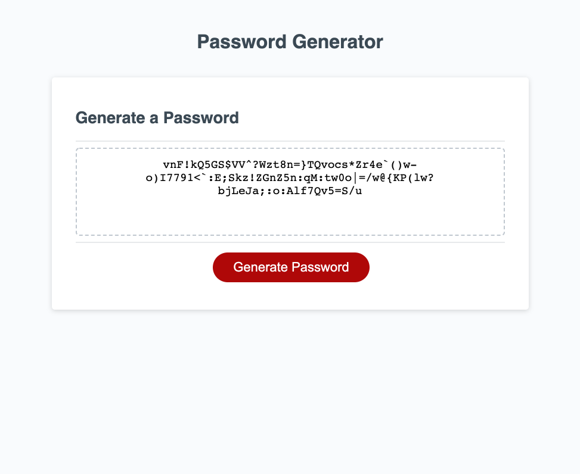

# Password Generator

## Description
---
This is a random password generator. When you click on the Generate Password button you are prompted to select the length and the types of characters to be included in your password. Once you select the desired criteria the password is displayed on the screen.

## Features
---
Uses prompts to allow maximum control of the content and nature of the password generated. The program features a simple UI utilizing a button and a textarea. We use  random number generation along with array creation to randomize the characters generated.

## Usage
---
To use, go to the website. then click on the Generate Password button. Answer the prompts and then you will be provided with a password on the screen.

## Link to website/environment
---
[Password-Generator](https://perfect-perfect.github.io/password-generator/)

## License
---
MIT License

Copyright (c) 2021 Gilberto Jesus Covarrubias Merino

Permission is hereby granted, free of charge, to any person obtaining a copy
of this software and associated documentation files (the "Software"), to deal
in the Software without restriction, including without limitation the rights
to use, copy, modify, merge, publish, distribute, sublicense, and/or sell
copies of the Software, and to permit persons to whom the Software is
furnished to do so, subject to the following conditions:

The above copyright notice and this permission notice shall be included in all
copies or substantial portions of the Software.

THE SOFTWARE IS PROVIDED "AS IS", WITHOUT WARRANTY OF ANY KIND, EXPRESS OR
IMPLIED, INCLUDING BUT NOT LIMITED TO THE WARRANTIES OF MERCHANTABILITY,
FITNESS FOR A PARTICULAR PURPOSE AND NONINFRINGEMENT. IN NO EVENT SHALL THE
AUTHORS OR COPYRIGHT HOLDERS BE LIABLE FOR ANY CLAIM, DAMAGES OR OTHER
LIABILITY, WHETHER IN AN ACTION OF CONTRACT, TORT OR OTHERWISE, ARISING FROM,
OUT OF OR IN CONNECTION WITH THE SOFTWARE OR THE USE OR OTHER DEALINGS IN THE
SOFTWARE.

